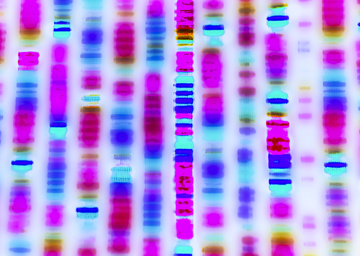
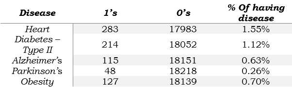

# Predicting Human Disease using Genomic Dataset

## Data Imbalance:

## Background:  
Traditionally diseases are assessed by looking at their Symptoms by their family general practitioners. Although this method is effective, there is a slim chance that they might misinterpret a disease and mistreat it. Mistreating could result in being harmful to individuals receiving those treatments. But, understanding the genomic structure of the individuals could help us give a better view of the diseases that are likely to happen.   
## Methods: 
We have used a Genomic sequencing dataset by Gene Ontology which has 11950 predictors of 18418 individuals. We will be <b>predicting Heart Disease, Type II Diabetes, Alzheimer, Parkinson and Obesity</b>. Since the target features of these diseases are imbalanced, we will be using <b>upsampling methods ADASYN (Adaptive Synthetic) and SMOTE (Synthetic Minority Over-Sampling technique)</b>. We'll build <b>logistic regression, random forest and neural network models </b> for three versions of the dataset for each disease. Later the models were evaluated by looking at their Accuracy, Precision, Recall, F1 Score and ROCAUC Score using a confusion matrix.   
## Result & Conclusion: 
We managed to build logistic regression, random forest and neural network model for each disease having different versions of the dataset with <b> ROCAUC scores for the generic dataset, ADASYN dataset and SMOTE dataset between 0.49 to 0.63, 0.49 to 0.59 and 0.49 - 0.59 respectively </b>.
